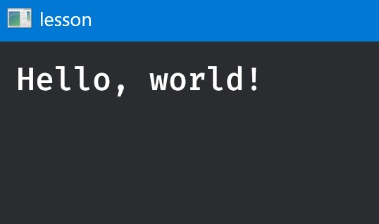
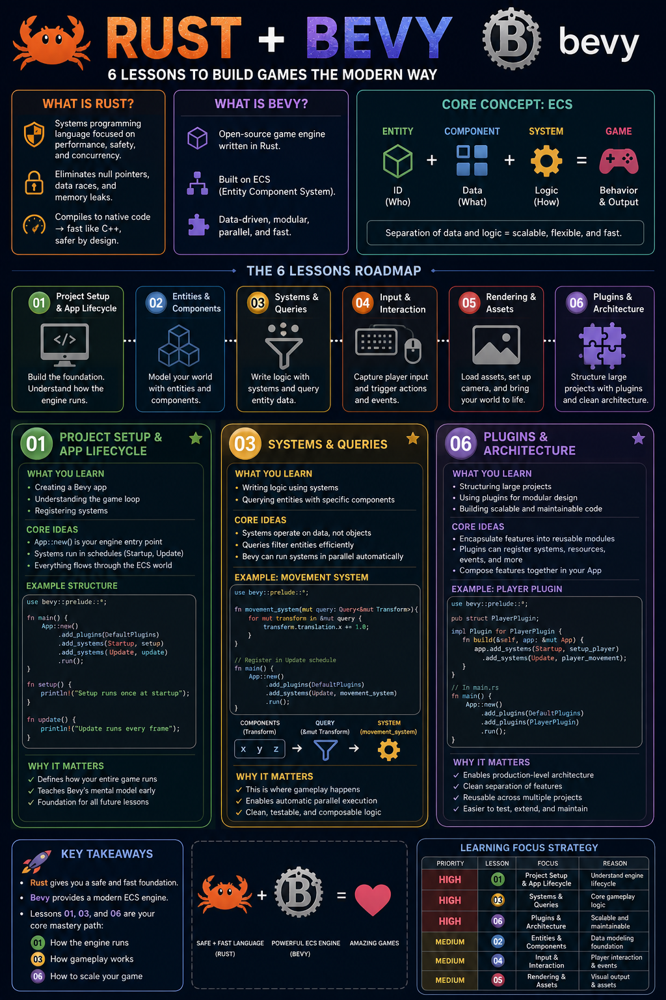

# Bevy Lessons

Small, self-contained Bevy lesson crates for learning engine basics one step at a time.

### Screenshot

### InfoGraphic

## Scripts

| # | Name | Description |
| -- | ---- | ----------- |
| 00 | [`Install_Dependencies.ps1`](./Scripts/Common/Install_Dependencies.ps1) | Installs dependencies and checks the workspace. |
| 01 | [`Run_Lesson_01_NoPlugins.ps1`](./Scripts/Common/Run_Lesson_01_NoPlugins.ps1) | Shows a Bevy app without plugins. |
| 02 | [`Run_Lesson_02_NoPluginsComponent.ps1`](./Scripts/Common/Run_Lesson_02_NoPluginsComponent.ps1) | Shows components and delayed logging. |
| 03 | [`Run_Lesson_03_SomePlugins.ps1`](./Scripts/Common/Run_Lesson_03_SomePlugins.ps1) | Shows a minimal window plugin set. |
| 04 | [`Run_Lesson_04_DefaultPlugins.ps1`](./Scripts/Common/Run_Lesson_04_DefaultPlugins.ps1) | Shows a window with DefaultPlugins. |
| 05 | [`Run_Lesson_05_Basic2D.ps1`](./Scripts/Common/Run_Lesson_05_Basic2D.ps1) | Shows basic 2D keyboard movement. |
| 06 | [`Run_Lesson_06_Basic3D.ps1`](./Scripts/Common/Run_Lesson_06_Basic3D.ps1) | Shows basic 3D keyboard movement. |

## Resources

| Resource | Description |
| -------- | ----------- |
| [The Rust Programming Language](https://doc.rust-lang.org/book/) | Official Rust language learning book. |
| [Bevy Learn](https://bevy.org/learn/) | Official Bevy learning resources hub. |
| [Unofficial Bevy Cheat Book](https://bevy-cheatbook.github.io/) | Practical Bevy patterns and examples. |

## Credits

**Created By**

- Samuel Asher Rivello
- Over 25 years XP with game development (2025)
- Over 10 years XP with Unity (2025)

**Contact**

- Twitter - [@srivello](https://twitter.com/srivello)
- Git - [Github.com/SamuelAsherRivello](https://github.com/SamuelAsherRivello)
- Resume & Portfolio - [SamuelAsherRivello.com](https://www.SamuelAsherRivello.com)
- LinkedIn - [Linkedin.com/in/SamuelAsherRivello](https://www.linkedin.com/in/SamuelAsherRivello)

**License**

Provided as-is under [MIT License](./LICENSE) | Copyright ™ & © 2006 - 2026 Rivello Multimedia Consulting, LLC
